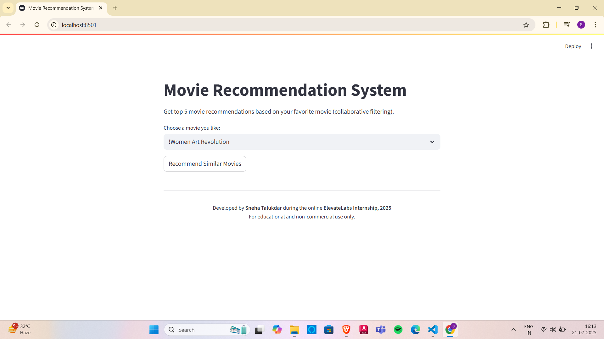
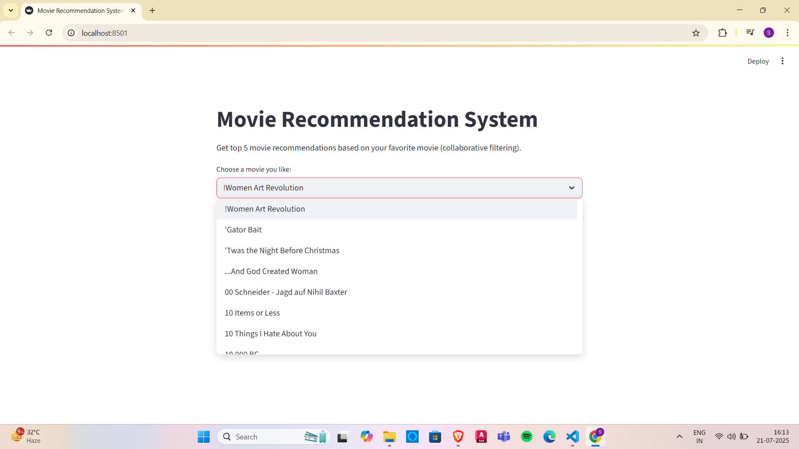
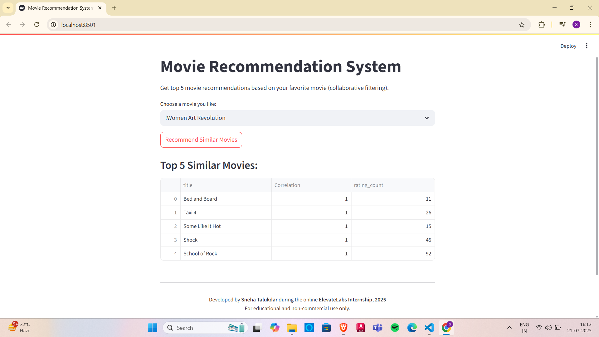
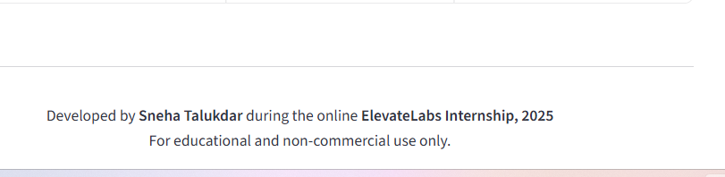

#  Movie Recommendation System

This is a personalized movie recommendation system that uses collaborative filtering to suggest related movies based on any title.

>  Developed by **Sneha Talukdar**  
>  As part of the **ElevateLabs Internship, 2025**


## Key Features :

-> It uses collaborative filtering to suggest the top five similar films.
-> It is constructed by using a real-world movie dataset.
-> It utilizes **Streamlit**, **Pandas**, and **Scikit-Learn**.
-> It is clear, interactive user interface - Quick and light app.
-> It is completely tested and operational.


##  Screenshots :

###  Home Screen -> 

###  Movie Selected -> 

###  Recommendations Displayed -> 

###  Footer with Developer Credits -> 


## Overview of the project :

I created this movie recommendation system project as part of my 2025 ElevateLabs internship.  
- It uses collaborative filtering to recommend the top 5 similar films based on the user's chosen film.  
- The application makes use of the MovieLens dataset and is developed with Python, Pandas, and Streamlit.


##  Tech Stack :

- **Python 3.11** .
- **Pandas** – for manipulating data .
- **Scikit-learn** – for building the similarity model .
- **Streamlit** – for building the web user interface (UI) .


## Running locally :
## How to Execute Locally

1. Verify that **pip** and **Python 3.11** are installed.

2. Save this project folder to your computer by downloading it or copying it.

3. Launch the project folder's terminal and type: ```bash pip install -r requirements.txt .

4. Launch the app:
streamlit run notebooks/app.py

5. Open browser at:
http://localhost:8501 (on developer's computer).

http://192.168.29.9:8501 (for accessing from any another device but on the same network).

## Live App Link (after deployment) :
[Movie Recommendation System app->](https://movie-recommendations-system-meq6ekbxfda23hszn6luro.streamlit.app/)

## Project Report:
[Project Report PDF->](https://github.com/SnehaTalukdar/Movie-Recommendations-System/blob/main/Movie-Recommendations-System_Project-Report_By-Sneha-Talukdar.pdf)

## License:
[License File->](https://github.com/SnehaTalukdar/Movie-Recommendations-System/blob/main/LICENSE)

## Author:
Developed by Sneha Talukdar
B.Tech CSE (AI & ML)
Kolkata, West Bengal, India.

This is a project of my ElevateLabs Internship, 2025.

This project is for Educational and Non-Commercial purposes only.
